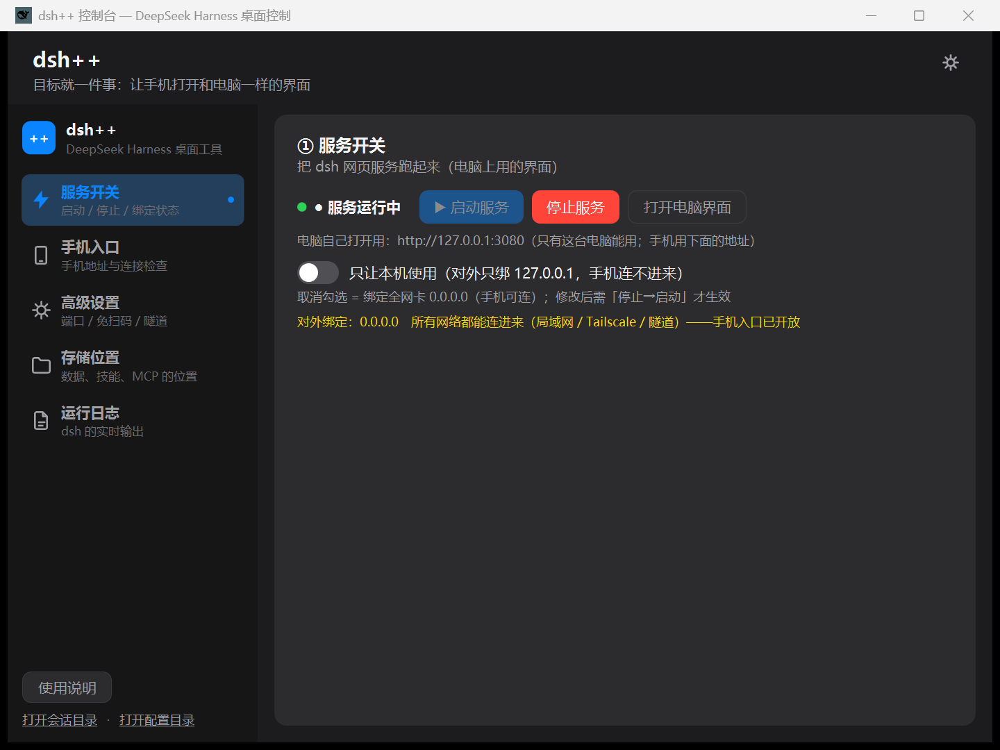
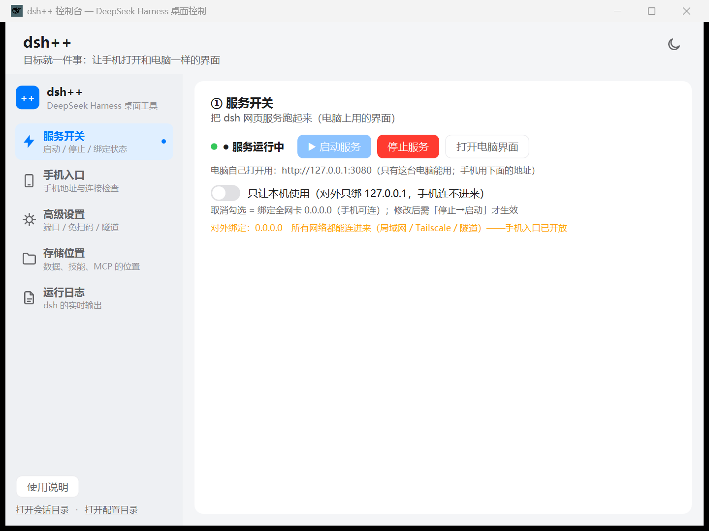

# dsh++

<p align="center">
  
</p>

<p align="center">
  <b>dsh++</b> —— DeepSeek Harness（dsh）的桌面控制台插件（dsh-plugin）
</p>

<p align="center">
  
  
  
  
  
  
</p>

**dsh++ 是什么？** 一句话：**把 DeepSeek Harness 的 `dsh web` 从命令行搬进一个漂亮的桌面应用**，让手机随时打开和电脑完全同步的界面（包括实时思考过程），并集中管理端口、域名、防火墙、Tailscale 和各类存储位置。

界面基于 WPF 重写，采用 **App Shell UI** 设计语言（`app-shell-ui` skill）：侧边栏导航 + 内容卡片、单一品牌蓝、深浅双主题一键切换、描边图标、设置列表式排版。

## ✨ 功能

- **一键启停**：启动 / 停止 `dsh web`，实时显示运行状态与对外绑定地址（0.0.0.0 全网卡 or 127.0.0.1 仅本机）
- **手机入口**：三种连接方式（同一 Wi-Fi / 自定义域名 / Tailscale），大字手机地址一键复制，附「缺什么点什么」连接检查清单
- **Tailscale 集成**：登录 / 连接 / 断开 / 安装，状态实时显示（IP、ts.net 域名）
- **存储位置管理**：查看 / 修改 / 打开 dsh 各类数据目录（settings、sessions、storages、profiles、skills、agent-presets），技能与 MCP 的位置一键直达
- **免扫码直连**：一键关闭手机远程插件的配对门禁（`requirePairingForLan`）
- **自动公网隧道**：autoTunnel 开关 + 临时随机域名实时显示
- **浏览器兼容补丁**：自动为网页入口注入 `crypto.randomUUID` / `AbortSignal.*` 等 polyfill（旧手机浏览器可用，npm 更新后自动重新注入）
- **运行日志**：dsh 输出实时滚动查看
- **深浅双主题**：右上角一键切换（应用自动重启），标题栏 / 侧边栏 / 卡片全套 token 换肤

## 📸 截图

| 深色主题 | 浅色主题 |
| --- | --- |
|  |  |

## 🚀 快速开始

### 前置条件

- Windows 10/11，[.NET 8 Desktop Runtime](https://dotnet.microsoft.com/download/dotnet/8.0)（开发需 SDK）
- 已安装 [DeepSeek Harness](https://www.npmjs.com/package/@deepseek-ai/dsh)（`@deepseek-ai/dsh`，≥ 0.1.0-rc.6）

### 使用发布版

1. 下载 [最新 Release](https://github.com/Jensen-Yao/dsh-plus-plus/releases) 的 `dsh-plus-plus.exe` 与 `compat-polyfill.js`，放同一目录
2. 双击运行，在「④ 存储位置」确认 DSH 主目录正确
3. 点「① 服务开关」→「▶ 启动服务」
4. 点「② 手机入口」→「复制手机地址」，发到手机浏览器打开

### 从源码构建

```bash
git clone https://github.com/Jensen-Yao/dsh-plus-plus.git
cd dsh-plus-plus
dotnet publish dsh-plus-plus.csproj -c Release -r win-x64 -o publish
# 产物：publish/dsh-plus-plus.exe + compat-polyfill.js
```

自检（无窗口诊断，输出到 `%TEMP%\dsh-control-smoke.txt`）：

```bash
dsh-plus-plus.exe --smoke
```

## 🔧 配置说明

| 配置 | 说明 |
| --- | --- |
| 端口 | `dsh web` 监听端口（默认 3080） |
| 只让本机使用 | 勾选 = 绑定 127.0.0.1（手机连不进来）；取消 = 绑定 0.0.0.0 全网卡 |
| 手机访问方式 | 自动 IP 直连 / 自定义域名（自动加入 `--trusted-host`）/ Tailscale（自动取 ts.net 域名） |
| 免扫码直接访问 | 关闭 `remote-web-ui` 的配对门禁，手机打开地址即可用 |
| 自动公网隧道 | `autoTunnel`：生成 trycloudflare.com 临时随机域名（仅供扫码配对） |
| DSH 主目录 / Agents 目录 | 启动时注入 `DSH_HOME` / `DSH_AGENTS_HOME` 环境变量 |
| 主题 | `dark` / `light`，右上角图标一键切换 |

配置文件保存在 `%APPDATA%\dsh-control\config.json`；修改端口/方式/域名/存储位置后需「停止→启动」生效。

## 📁 仓库结构

```
dsh-plus-plus/
├── dsh-plus-plus.csproj      # 主项目（net8.0-windows + WPF）
├── App.xaml(.cs)             # 应用入口与主题装配（dark/light 资源字典）
├── MainWindow.xaml(.cs)      # 主窗口：侧边栏 + 五个页面
├── DshService.cs             # 控制逻辑（与界面解耦）：启停/端口/绑定/Tailscale/存储
├── Config.cs                 # 配置读写（%APPDATA%\dsh-control\config.json）
├── TailscaleCli.cs           # tailscale CLI 封装
├── FrontendPatch.cs          # 手机浏览器兼容补丁注入
├── HelpWindow / InputDialog  # 使用说明 / 路径输入对话框
├── Themes/                   # app-shell-ui 双主题 token 与控件样式
├── compat-polyfill.js        # 手机浏览器兼容补丁（自动注入网页入口）
├── icon-gen/                 # 图标生成工具（PNG → 多尺寸 ICO）
├── patches/lan.patch.yml     # dsh 全网卡绑定补丁（--patch 注入）
├── scripts/                  # 命令行启动脚本（run-dsh-web.cmd 等）
└── docs/                     # 项目页面与截图（GitHub Pages）
```

## 🏷️ 与 DeepSeek Harness 的关系

- 本仓库是 **dsh-plugin** 生态的一部分：以 `--patch` 覆盖层方式增强 `dsh web` 的启动与配置，不修改 dsh 本体
- 关联插件：[dsh-web-ui](https://github.com/zhu1090093659/dsh-web-ui)（手机远程控制 / 扫码配对插件，本工具直接驱动其配置）
- 网络层：可选集成 [Tailscale](https://tailscale.com/)（跨网络完全实时）与 Cloudflare 快速隧道

## 📄 License

[MIT](LICENSE)
